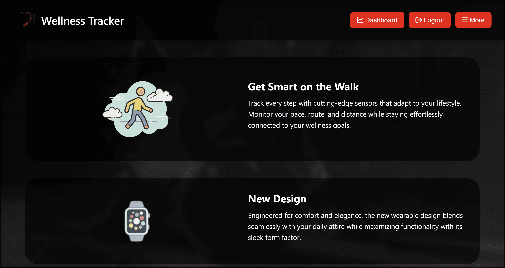

<a id="readme-top"></a>

[![Contributors][contributors-shield]][contributors-url]
[![Forks][forks-shield]][forks-url]
[![Commits][commits-shield]][commits-url]
[![Issues][issues-shield]][issues-url]
[![License][license-shield]][license-url]

[contributors-shield]: https://img.shields.io/github/contributors/W0lverine07/Agile-Group-Project.svg?style=for-the-badge
[contributors-url]: https://github.com/W0lverine07/Agile-Group-Project/graphs/contributors

[forks-shield]: https://img.shields.io/github/forks/W0lverine07/Agile-Group-Project.svg?style=for-the-badge
[forks-url]: https://github.com/W0lverine07/Agile-Group-Project/network/members

[commits-shield]: https://img.shields.io/github/commit-activity/m/W0lverine07/Agile-Group-Project?style=for-the-badge
[commits-url]: https://github.com/W0lverine07/Agile-Group-Project/commits/main

[issues-shield]: https://img.shields.io/github/issues/W0lverine07/Agile-Group-Project.svg?style=for-the-badge
[issues-url]: https://github.com/W0lverine07/Agile-Group-Project/issues

[license-shield]: https://img.shields.io/github/license/W0lverine07/Agile-Group-Project.svg?style=for-the-badge
[license-url]: https://github.com/W0lverine07/Agile-Group-Project/blob/main/LICENSE


<!-- PROJECT LOGO -->
<br />
<div align="center">
<!-- <a href="https://github.com/github_username/repo_name"> -->
    
<!--  </a> -->

<h3 align="center">WELLNESS TRACKER</h3>
<h4 align="center">Track Better. Live Healthier. One Habit at a Time.</h4>

  <p align="center">
    The Wellness Tracker is a web-based application designed to help users monitor, analyze, and improve their overall well-being. This interactive platform enables users to log and visualize personal health details such as calories burnt, active time, lifestyle habits, etc.
  </p>
</div>


<!-- TABLE OF CONTENTS -->
<details>
  <summary>Table of Contents</summary>
  <ol>
    <li>
      <a href="#about-the-project">About The Project</a>
      <ul>
        <li><a href="#built-with">Built With</a></li>
      </ul>
    </li>
    <li>
      <a href="#getting-started">Getting Started</a>
      <ul>
        <li><a href="#prerequisites">Prerequisites</a></li>
        <li><a href="#installation">Installation</a></li>
      </ul>
    </li>
    <li><a href="#usage">Usage</a></li>
    <li><a href="#Testing">Testing</a></li>
    <li><a href="#Contributors">Contributors</a></li>
  </ol>
</details>


<!-- ABOUT THE PROJECT -->
## About The Project


Here's a blank template to get started. To avoid retyping too much info, do a search and replace with your text editor for the following: `github_username`, `repo_name`, `twitter_handle`, `linkedin_username`, `email_client`, `email`, `project_title`, `project_description`, `project_license`

<p align="right">(<a href="#readme-top">back to top</a>)</p>


### Built With

* [![Next][Next.js]][Next-url]
* [![React][React.js]][React-url]
* [![Vue][Vue.js]][Vue-url]
* [![Angular][Angular.io]][Angular-url]
* [![Svelte][Svelte.dev]][Svelte-url]
* [![Laravel][Laravel.com]][Laravel-url]
* [![Bootstrap][Bootstrap.com]][Bootstrap-url]
* [![JQuery][JQuery.com]][JQuery-url]

<p align="right">(<a href="#readme-top">back to top</a>)</p>


<!-- GETTING STARTED -->
## Getting Started

This is an example of how you may give instructions on setting up your project locally.
To get a local copy up and running follow these simple example steps.

### Prerequisites

This is an example of how to list things you need to use the software and how to install them.
* npm
  ```sh
  npm install npm@latest -g
  ```

### Installation


1. Clone the repository:
   ```
   git clone <repository-url>
   cd wellness-tracker
   ```

2. Create and activate a virtual environment:
   ```
   python -m venv venv
   source venv/bin/activate  # On Windows, use: venv\Scripts\activate
   ```

3. Install the required packages:
   ```
   pip install -r requirements.txt
   ```

4. Run the application:
   ```
   python run.py
   ```

5. Access the application in your web browser:
   ```
   http://localhost:5002
   ```

<p align="right">(<a href="#readme-top">back to top</a>)</p>


<!-- USAGE EXAMPLES -->

## Usage

### Creating an Account
1. Navigate to the login page
2. Click on the "Register" button
3. Fill in your username and password
4. Complete your personal profile

### Recording Activities
1. Log in to your account
2. Go to "Record Activity" from the dashboard
3. Select the exercise type, date, and duration
4. Save your activity

### Viewing Analytics
1. Navigate to the "Analytics" page from the dashboard
2. Select your preferred time period (week, month, year)
3. Explore different visualizations of your activity data

### Sharing Progress
1. Go to the "Share" page
2. Select the activity or achievement you want to share
3. Choose which users to share with
4. Add an optional message

<p align="right">(<a href="#readme-top">back to top</a>)</p>


## Testing

### Running Unit Tests
```
python -m pytest tests/test_unit.py -v
```

### Running Selenium Tests
```
python -m tests.test_selenium
```

<!-- CONTRIBUTING -->

## Contributors

- Sheikh
- Rui
- Dani
- Mudit

<p align="right">(<a href="#readme-top">back to top</a>)</p>


<!-- MARKDOWN LINKS & IMAGES -->
<!-- https://www.markdownguide.org/basic-syntax/#reference-style-links -->

[Next.js]: https://img.shields.io/badge/next.js-000000?style=for-the-badge&logo=nextdotjs&logoColor=white
[Next-url]: https://nextjs.org/
[React.js]: https://img.shields.io/badge/React-20232A?style=for-the-badge&logo=react&logoColor=61DAFB
[React-url]: https://reactjs.org/
[Vue.js]: https://img.shields.io/badge/Vue.js-35495E?style=for-the-badge&logo=vuedotjs&logoColor=4FC08D
[Vue-url]: https://vuejs.org/
[Angular.io]: https://img.shields.io/badge/Angular-DD0031?style=for-the-badge&logo=angular&logoColor=white
[Angular-url]: https://angular.io/
[Svelte.dev]: https://img.shields.io/badge/Svelte-4A4A55?style=for-the-badge&logo=svelte&logoColor=FF3E00
[Svelte-url]: https://svelte.dev/
[Laravel.com]: https://img.shields.io/badge/Laravel-FF2D20?style=for-the-badge&logo=laravel&logoColor=white
[Laravel-url]: https://laravel.com
[Bootstrap.com]: https://img.shields.io/badge/Bootstrap-563D7C?style=for-the-badge&logo=bootstrap&logoColor=white
[Bootstrap-url]: https://getbootstrap.com
[JQuery.com]: https://img.shields.io/badge/jQuery-0769AD?style=for-the-badge&logo=jquery&logoColor=white
[JQuery-url]: https://jquery.com 
