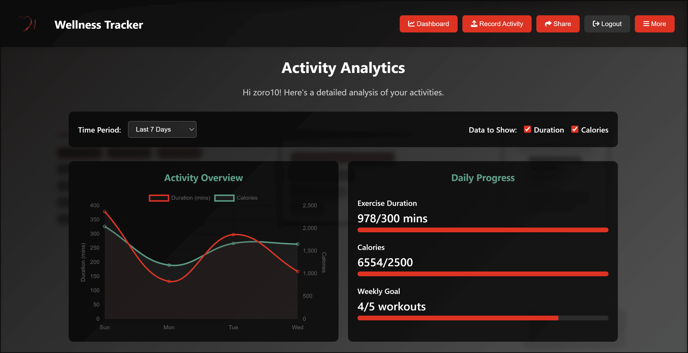

<!-- PROJECT LOGO -->
<br />
<div align="center">
<!-- <a href="https://github.com/github_username/repo_name"> -->
    
<!--  </a> -->

<h3 align="center">WELLNESS TRACKER</h3>
<h4 align="center">Track Better. Live Healthier. One Habit at a Time.</h4>

  <p align="center">
    The Wellness Tracker is a web-based application designed to help users monitor, analyze, and improve their overall well-being. This interactive platform enables users to log and visualize personal health details such as calories burnt, active time, lifestyle habits, etc.
  </p>
</div>


<!-- TABLE OF CONTENTS -->
<details>
  <summary>Table of Contents</summary>
  <ol>
    <li>
      <a href="#about-the-project">About The Project</a>
    </li>
    <li>
      <a href="#getting-started">Getting Started</a>
      <ul>
        <li><a href="#prerequisites">Prerequisites</a></li>
        <li><a href="#installation">Installation</a></li>
      </ul>
    </li>
    <li><a href="#usage">Usage</a></li>
    <li><a href="#Testing">Testing</a></li>
    <li><a href="#Contributors">Contributors</a></li>
  </ol>
</details>


<!-- ABOUT THE PROJECT -->
## About The Project



<p align="right">(<a href="#readme-top">back to top</a>)</p>


<!-- GETTING STARTED -->
## Getting Started

This is an example of how you may give instructions on setting up your project locally.
To get a local copy up and running follow these simple example steps.

### Prerequisites

This is an example of how to list things you need to use the software and how to install them.
* npm
  ```sh
  npm install npm@latest -g
  ```

### Installation


1. Create and activate a virtual environment:
   ```
   python -m venv venv
   source venv/bin/activate  # On Windows, use: venv\Scripts\activate
   ```

2. Install the required packages:
   ```
   pip install -r requirements.txt
   ```

3. Run the application:
   ```
   python run.py
   ```

4. Access the application in your web browser:
   ```
   http://localhost:5002
   ```

<p align="right">(<a href="#readme-top">back to top</a>)</p>


<!-- USAGE EXAMPLES -->

## Usage

### Creating an Account
1. Navigate to the login page
2. Click on the "Register" button
3. Fill in your username and password
4. Complete your personal profile

### Recording Activities
1. Log in to your account
2. Go to "Record Activity" from the dashboard
3. Select the exercise type, date, and duration
4. Save your activity

### Viewing Analytics
1. Navigate to the "Analytics" page from the dashboard
2. Select your preferred time period (week, month, year)
3. Explore different visualizations of your activity data

### Sharing Progress
1. Go to the "Share" page
2. Select the activity or achievement you want to share
3. Choose which users to share with
4. Add an optional message

<p align="right">(<a href="#readme-top">back to top</a>)</p>


## Testing

### Running Unit Tests
```
python -m pytest tests/test_unit.py -v
```

### Running Selenium Tests
```
python -m tests.test_selenium
```

<!-- CONTRIBUTING -->

## Contributors

- Sheikh
- Rui
- Dani
- Mudit

<p align="right">(<a href="#readme-top">back to top</a>)</p>

